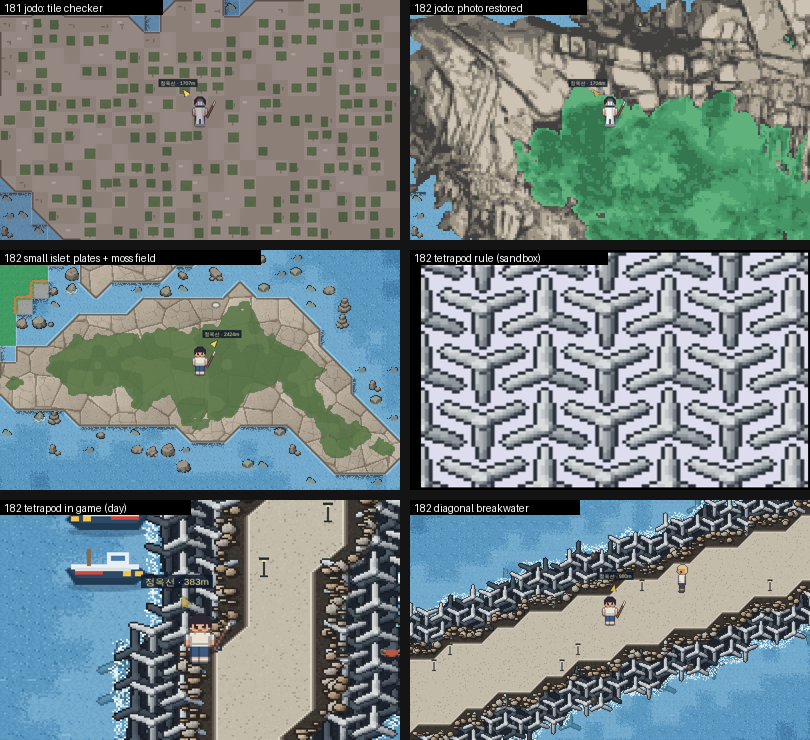

# 182차 — 조도 사진 셀 복구 · 소형 섬 무이음 암반 · 테트라포드 레퍼런스 배치 · 청크 선행 로드

| | |
|---|---|
| **날짜** | 2026-09-28 |
| **시스템** | `필드` `타일 렌더` `타일 파이프라인` `성능` |
| **트리거** | 사용자 지시 2건 + 작업 중 레퍼런스 도안 1장(테트라포드) |
| **커밋** | 이 차수 커밋 |
| **빌드·타입체크** | 3/3 · 0 오류 |

---

## 1. 배경

사용자 원문:

> 조도 또한 마찬가지로 적용해주고, 속도 부분에서 랜더링하는데 시간이 오래 걸리면,
> 맵 이동 시에 미리 pre-load하는 방법을 고려해보는 건 어떨까?
> 아 그리고, 위 수정사항 반영 끝나면, main에 push하고, gh-pages 재배포해줘.

작업 중 추가(도안 첨부 — 세로 열마다 ⅄·Y가 번갈아 서고, 옆 열과 팔이 쐐기처럼 맞물린 배치):

> 테트라포트 타일 간격을 이런 식의 규칙으로 배치하라는 말이야. 조금 더 디테일하게 교정해야겠지?

---

## 2. 원인

### 2-1. 조도가 격자판으로 보인 기전 — ⚠ 172차 회귀

- 조도는 115·116차에 **사진 시트(`ts_jodo_sheet`) 셀 1,074개**를 `patch.json`의 `tileTex`로 얹어 그렸다.
- 172차가 속초를 재빌드할 때 `tools/build_region_maps.py`가 patch를 **`tiles/props/roofs` 3키 화이트리스트**로만
  복사해, 런타임 `public/data/sokcho_v2/patch.json`에서 **`tileTex`가 조용히 사라졌다**(정본 `pixelazed/…/patch.json`에는 남아 있었다).
- 그 뒤로 조도는 절차 폴백 패스를 탔다 — **타일마다 두 톤 중 하나로 칠하고(체커), 안쪽 타일마다 이끼 사각형 한 장**.
  181차 스크린샷에서 "조도 격자"로 보인 것이 이것이다(181차 문서는 사전 결함으로 적었지만 실제로는 172차 회귀였다).

### 2-2. 소형 섬 모서리의 계단형 밝은 네모

- 섬 암반 타일이 45°로 깎이면 그 자리엔 물이 드러나는데, 이웃 **물 타일 쪽**이 공유 변을 따라
  포말선(밝음)과 `drawReliefShadow` 그림자(어두움)를 **타일 변 직선으로** 그었다 → 45° 물가 옆에 계단 윤곽.

### 2-3. 테트라포드 배치가 도안과 달랐던 점(181-b 기준)

| 항목 | 181-b | 도안 실측 |
|---|---|---|
| ⅄ 내려앉음 | 피치의 36%(10/28) — 행이 엇갈림 | 약 7% — 행 높이 거의 같음 |
| 가로 피치 / 팔 길이 | 1.12 | 1.29(187/145) |
| 세로 피치 / 팔 길이 | 1.31 | 1.50(218/145) |
| 팔 폭 / 팔 길이 | ≈ 0.5(짧고 굵음) | ≈ 0.33 |
| 곁다리 각(수평 기준) | 30°(120° 삼지) | 25~27° |
| 기울기 흔들림 | ±6° | 없음(맞물림이 정확) |

### 2-4. 청크 이동 끊김 — 굽기보다 "장식 재생성"이 컸다

헤드리스 측정(자전거 420px/s · 60fps 가정 · 도심 왕복 경로 3,661프레임 · 고유 청크 51장):

- 화면 팝인은 0 — 3×3 여유로 충분했다.
- **굽기 72회 중 30회(42%)가 재굽기** — 3×3에서 벗어나는 즉시 내리고, 되돌아오면 다시 구웠다.
- **청크 로드 1회 최대 380ms**(이후 측정에서 1,127ms) — `buildChunkDeco`가 **건물마다 지붕 RenderTexture를 새로 만들고**
  내릴 때 파괴했다(지붕 비용이 장식 비용의 99%).

---

## 3. 변경

| 구분 | 대상 | 내용 |
|---|---|---|
| 수정 | [tools/build_region_maps.py](../../../tools/build_region_maps.py) | patch **모든 키 보존**(`patch.update(loaded)`) — `tileTex` 유실 차단 |
| 복구 | [public/data/sokcho_v2/patch.json](../../../packages/client-pc/public/data/sokcho_v2/patch.json) | 정본에서 `tileTex` 1,074셀 복원(타 키 동일 확인) |
| 신설 | [SurfaceArt.ts](../../../packages/client-pc/src/scenes/SurfaceArt.ts) `paintRockAtlas` · `worley` | 주기 보로노이 판(판마다 명도·기울기) + 각진 판 경계 균열 · 잔균열 |
| 수정 | `SurfaceArt.paintTetrapod` · `TetraShape` | 선택 필드 `side`(곁다리 각)·`art`(캔버스) — 기본값은 종전과 동일 |
| 수정 | `TETRA_SHAPE` · `TETRA_ART` | 도안 비율: reach 10.2 · hub 2.8 · w 2.8→2.4 · side 26° · 캔버스 26 |
| 신설 | [SeamlessChunks.ts](../../../packages/client-pc/src/scenes/SeamlessChunks.ts) `computeIsletDepth` · `drawIsletMoss` · `isletCutAt` · `isletEdgeOpen` | 섬 암반 = L1 아틀라스 프레임(모서리는 45° 삼각 프레임) · 이끼 = **월드 좌표 연속장**(섬 안쪽 깊이 쌍선형 + 노이즈) |
| 수정 | 물 절차 패스 `noRim` · `drawReliefShadow` | 이웃 섬 타일의 공유 변이 45°로 깎였으면 포말·그림자를 긋지 않는다 · 빗변 포말은 섬 쪽이 긋는다 |
| 수정 | `TTP_DX/DY/INV_OY` + `TTP_LOW_OX/OY` | **32 / 36 / 3** · 아래 층 = 열 사이 반 칸(16, 18)·왼쪽 열과 같은 방위 · 기울기 ±3° · 키 `srf_ttp4_*` |
| 신설 | 예열 캐시 `warm`(최대 16) · `putWarm` · `dropWarm` · `clearSlotContents` · `setDecoVisible` | 3×3 밖으로 나간 청크의 **구운 RT·지붕·프롭·충돌을 숨긴 채 보관**, 되돌아오면 켜기만 |
| 신설 | `prefetchOne` · 속도 추정(`velX/velY`) | 다음 중심 청크의 3×3 중 **새로 필요해질 칸만**(직진 3 · 대각 5) 한가한 프레임에 굽기 → 다음 기회에 장식 |
| 신설 | `loadQueue` · `chunkDist` | 경계 통과 때 화면에서 먼(760px 초과) 청크는 프레임당 1장씩 로드 · 굽기는 가까운 것부터 |
| 신설 | `preloadAround` | 씬 진입·순간이동 직후 3×3을 **페이드인 동안 모두 굽는다** — RegionFieldScene 2곳 배선 |
| 수정 | `buildChunkRoofs` · `buildKitRoof` | **청크당 지붕 아틀라스 1장**(선반 패킹) + 건물마다 프레임 이미지 — 한 번의 `beginDraw/endDraw`로 묶음 |

---

## 4. 구조상 위치

- `필드 → 무이음 표면·방파제 피복(181) → 조도·소형 섬 / 테트라포드 격자` — **렌더 층**(데이터는 patch 복구뿐).
- `필드 → 청크 스트리밍(100) → 상주·예열·선행 로드` — **렌더/성능 층**. 충돌 바디 수명이 바뀐다
  (3×3 밖 예열 청크의 바디가 남는다 — 플레이어만 충돌하므로 닿을 수 없다).
- `타일 파이프라인 → build_region_maps` — **데이터 층**. 앞으로 patch에 새 키가 생겨도 보존된다.

---

## 5. 검증

| 대상 | 방법 | 결과 |
|---|---|---|
| 조도 | 실렌더(낮 조명 강제) — 본섬 898타일 사진 셀 덮임 | 116차 사진 그대로 · 격자 없음 |
| 소형 섬 4곳(177·57·16·10타일) | 실렌더 + 2px 확대 | 체커·사각 이끼 소멸 · 45° 물가 계단 소멸 |
| 테트라포드 | 샌드박스(현재·도안 비율 A/B·아래 층 3안) + 방파제 3곳 실렌더 | 도안과 같은 쐐기 맞물림 · 아래 층은 틈만 채움 |
| 스트리밍 | 왕복 경로 하네스(`chunkperf.cjs`) | 재굽기 **30 → 16** · 굽기 72 → 65 · 로드 1회 최대 **380 → 93ms** · 팝인 0 |
| 지붕 아틀라스 | 밀집 청크(건물 15채) 반복 5회 | 이전 105/27~31ms → 이후 **35/21~27ms** · 지붕 그림 픽셀 동일 |
| 예열 복원 | 같은 자리 → 5청크 이동 → 복귀 스크린샷 비교 | 차이 0.02%(캐릭터 주변 한 곳) |
| 회귀 | 도심·해변·사석·방파제 낮/밤 | 181차와 동일 · pageerror 0 |
| 빌드 | `pnpm run build` · client typecheck | 3/3 · 0 오류 |

⚠ 헤드리스는 CPU 소프트웨어 GL이라 **같은 코드의 프레임 시간이 2배 넘게 흔들린다** — 비교는 재굽기·로드 횟수 같은
구조적 작업량으로 했다. 경로 측정의 1초짜리 단발 프레임은 그 지점에서 처음 쓰는 절차 텍스처(크레인·어선) 생성 1회였다
(같은 청크 단독 8ms).

---

## 6. 잔여

- **실 GPU 계측** — 헤드리스로는 굽기 ms를 믿을 수 없다. 사용자 체감(끊김)이 남으면 계측 훅부터.
- **굽기 자체의 시분할** — `bakeChunkUnsafe`가 한 덩어리라 한 청크 굽기는 한 프레임에 들어간다(선행 굽기로 시점만 앞당김).
- **예열 캐시 크기 16** — 5청크 이상 곧게 갔다 오면 앞쪽 선행분이 뒤쪽 보관분을 밀어내 일부 재굽기(실측 10장).
- **소형 섬 암반 판 크기** — 보로노이 판이 균일해 자갈밭처럼 보일 수 있다(사진 시트가 있는 섬은 해당 없음).
- 181차 잔여 ②~⑤(꺾은선 척추 · TTP 상판 등치선 · 안벽 캡 · 피복 수동 지정)는 그대로.

---

## 7. 위험·부작용

- **VRAM** — 예열 16장 × 1024² RGBA ≈ 64MB + 청크당 지붕 아틀라스(대개 1~4MB). 저사양에서 문제가 되면 `WARM_MAX`를 줄인다.
- **예열 청크의 충돌 바디** — 3×3 밖에 남는다. 플레이어 외에 walls와 충돌하는 시스템이 생기면 재검토.
- **편집기(F7)** — 지형·프롭 수정 시 예열본은 버린다(`rebakeChunks`·`rebakeResident`에서 `dropWarm`).
- **테트라포드가 커졌다** — 한 개 폭 약 37 → 45px. 캐릭터(52px) 대비 여전히 작다(실물 비율은 더 크다).

---

## 8. 후속 반영

- [x] `03-WORKLOG/README.md` §3.1 행 추가
- [x] `02-SYSTEMS/world-field.md` §4 행 · §5 잔여 · §6 함정 3건
- [x] `04-BACKLOG.md` AE ① 해소 · 성능 행 갱신
- [x] `.agents/AGENTS.md` §9 · `.agents/IMPLEMENTATION_PLAN.md` · `CLAUDE.md` 직전 작업
- [x] gh-pages 18차 배포

